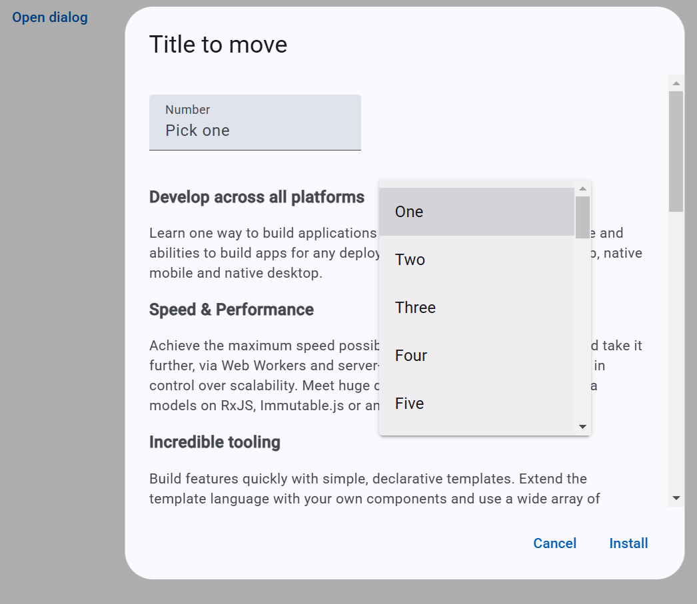

# Autocomplete Issue Demo

- Open dialog with some elements, to have scroll in the dialog
- Open Autocomplete items
- Scroll down dialog scroll and you will see the issue

- Open dialog with Autocomplete
- Open Autocomplete items (options)
- Mouse down on 'Title to move' and move dialog and see the issue

Issue link: <https://github.com/angular/components/issues/30254>
