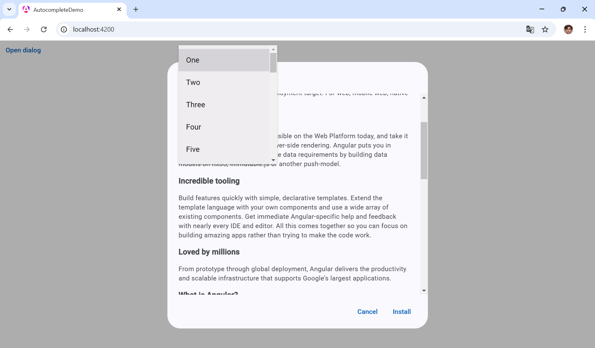

# Autocomplete Issue Demo

- Open dialog with some elements, to have scroll in the dialog
- Open Autocomplete items
- Scroll down dialog scroll and you will see issue

Issue link: <https://github.com/angular/components/issues/30254>
